### Hi Everyone 👋

<!--
**inhere/inhere** is a ✨ _special_ ✨ repository because its `README.md` (this file) appears on your GitHub profile.

Here are some ideas to get you started:

- 🔭 I’m currently working on Earth
- 🌱 I’m currently learning Go,Java
- 👯 I’m looking to collaborate on ...
- 🤔 I’m looking for help with ...
- 💬 Ask me about ...
- 📫 How to reach me: ...
- 😄 Pronouns: ...
- ⚡ Fun fact: ...
- 👯 I am participating in the contribution project: [Gookit](https://github.com/gookit) [Swoft](https://github.com/swoft-cloud)
-->

  <!-- GitHub 奖杯🏆 -->
   

  
## 🚀💻 Technologies & Tools

  
  
  
  
  
  

## Projects

[![ReadMe Card][inhere_markview_card]](https://github.com/inhere/markview)

[inhere_markview_card]: ./profile/pin-inhere-markview.svg

### [Gookit](https://github.com/gookit) Projects

|  |  |
|--------|-------|
[![ReadMe Card][gookit_color_card]](https://github.com/gookit/color) | [![ReadMe Card][gookit_slog_card]](https://github.com/gookit/slog) 
[![ReadMe Card][gookit_gcli_card]](https://github.com/gookit/gcli) |  [![ReadMe Card][gookit_goutil_card]](https://github.com/gookit/goutil) 
[![ReadMe Card][gookit_validate_card]](https://github.com/gookit/validate) |  [![ReadMe Card][gookit_config_card]](https://github.com/gookit/config) 

[gookit_color_card]: ./profile/pin-gookit-color.svg
[gookit_config_card]: ./profile/pin-gookit-config.svg
[gookit_gcli_card]: ./profile/pin-gookit-gcli.svg
[gookit_goutil_card]: ./profile/pin-gookit-goutil.svg
[gookit_slog_card]: ./profile/pin-gookit-slog.svg
[gookit_validate_card]: ./profile/pin-gookit-validate.svg

### Small tools 小工具

- [inherelab/eget](https://github.com/inherelab/eget) Easily install prebuilt binaries from GitHub. 从 GitHub 轻松安装预构建的二进制文件
- [inhere/skillc](https://github.com/inhere/skillc) Single binary file, a local Skill management tool for the multi-Agent ecosystem. 单二进制文件，面向多 Agent 生态的本地 Skill 管理工具
- [inhere/markview](https://github.com/inhere/markview) MarkView is a zero-config Markdown preview server powered by Go. 一个零配置的 Markdown 预览服务器，使用单个可执行程序提供功能。
- [inhere/homepagex](https://github.com/inhere/homepagex) 一个非常轻量的类似 Homer 的导航主页，使用 Go + Svelte 实现

## Contribuited Projects

|  |  |
|--------|-------|
[![ReadMe Card][swoft_card]](https://github.com/swoft-cloud/swoft) | [![ReadMe Card][openjob_card]](https://github.com/open-job/openjob) 

[swoft_card]: https://github-readme-stats.vercel.app/api/pin/?username=swoft-cloud&repo=swoft&show_owner=true
[openjob_card]: https://github-readme-stats.vercel.app/api/pin/?username=open-job&repo=openjob&show_owner=true
